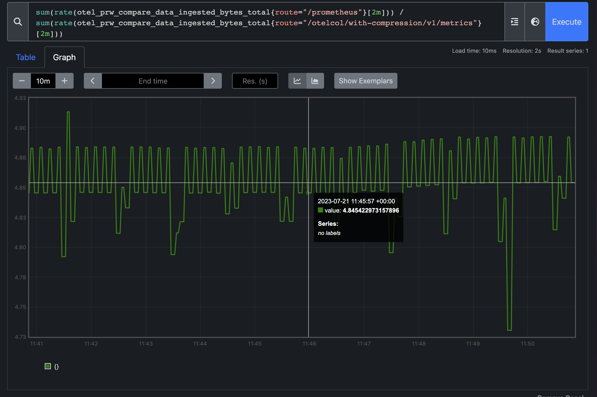
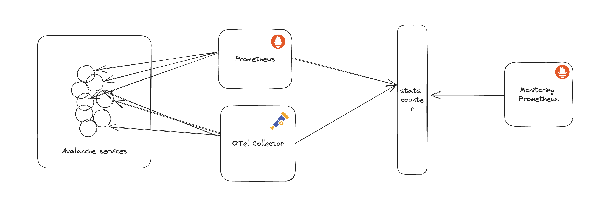

# Comparing the OTLP and Prometheus Remote Write

I wanted to see if OTLP is a more efficient format for transporting metrics in terms of data size. So for this, I setup
a system where both Prometheus and OTel Collector were scraping 100k metrics and writing to them a server which counts the
amount of data received.

## Results

### Round 1: With Avalanche

The results were a little surprising: **OTLP is ~5x more efficient**



But a little deeper analysis showed that the compression ratio acheived by gzip in OTLP is 70x.
This seems quite high and it could because avalanche has metrics named as:

```
# HELP avalanche_metric_mmmmm_13_0 A tasty metric morsel
# TYPE avalanche_metric_mmmmm_13_0 gauge
avalanche_metric_mmmmm_13_0{cycle_id="26",label_key_kkkkk_0="label_val_vvvvv_0",label_key_kkkkk_1="label_val_vvvvv_1",label_key_kkkkk_2="label_val_vvvvv_2",label_key_kkkkk_3="label_val_vvvvv_3",label_key_kkkkk_4="label_val_vvvvv_4",label_key_kkkkk_5="label_val_vvvvv_5",label_key_kkkkk_6="label_val_vvvvv_6",label_key_kkkkk_7="label_val_vvvvv_7",label_key_kkkkk_8="label_val_vvvvv_8",label_key_kkkkk_9="label_val_vvvvv_9",series_id="0"} 23
```

This is not very representative for a production system, but OTLP performed quite well, and my gut feeling is that OTLP (with the default gzip compression) might be better even in production.

### Round 2: With a regular workload

TODO.

## Architecture

